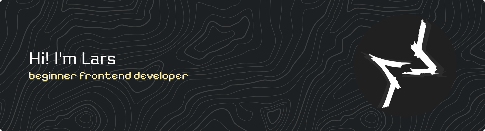

  

## I'm a second-year student at NOROFF School of Technology, specializing in Front-End Development. I love transforming design ideas into clean, functional code.

Education Focus: My primary goal is mastering the modern front-end stack, with a strong focus on JavaScript, UI/UX Design and having fun with it!

What I've done: I just successfully passed my first-year exams and am now accelerating my knowledge in complex JavaScript patterns and frameworks.

Ready to collaborate: I'm actively seeking opportunities for hands-on experience, including internships, volunteer work, or open-source contributions. Let's build something together!

Reach me: All my contact details and projects are available on my Portfolio (link in my profile).

Pronouns: He/Him

P.S. If you cut a hole in a net, the net will have fewer holes. Just throwing that out there. Like a net.

---

<picture>
  <source media="(prefers-color-scheme: dark)" srcset="https://raw.githubusercontent.com/larstp/larstp/output/github-contribution-grid-snake-dark.svg" />
  <source media="(prefers-color-scheme: light)" srcset="https://raw.githubusercontent.com/larstp/larstp/output/github-contribution-grid-snake.svg" />
  
</picture>

<!--
**larstp/larstp** is a ✨ _special_ ✨ repository because its `README.md` (this file) appears on your GitHub profile.

Here are some ideas to get you started:

- 🔭 I’m currently working on ...
- 🌱 I’m currently learning ...
- 👯 I’m looking to collaborate on ...
- 🤔 I’m looking for help with ...
- 💬 Ask me about ...
- 📫 How to reach me: ...
- 😄 Pronouns: ...
- ⚡ Fun fact: ...
-->
