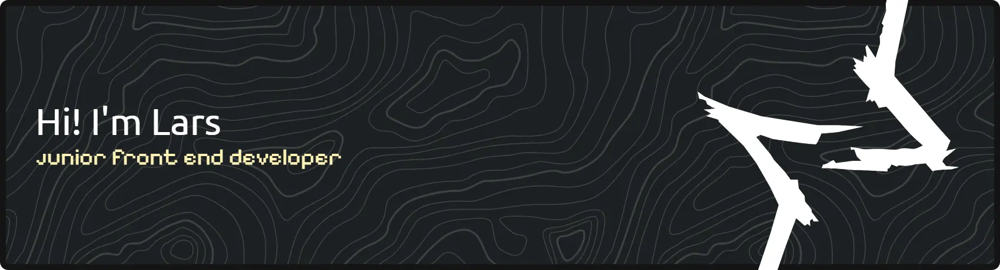

  

# Lars Torp Pettersen

Junior front-end developer based in Oslo, with a background in cinematography and a strong interest in design.
I work with HTML, CSS, JavaScript, TypeScript, React, and responsive UI.

## A couple of things I've built

- **[GcG Trading Platform](https://gcg.slovstuggu.com)** - a card trading platform for my local Gundam GCG group, focused on deck-building and trading via Discord (Work in progress)
- **[Mimir](https://mimir.larstp.com)** - a social platform built around API integration and CRUD functionality
- **[Barter](https://barter.larstp.com)** - an online auction house experience

## Currently

Looking for my first junior front-end role, freelance opportunities, and interesting projects.
Open to teams in Oslo, remote-friendly companies, and collaborations involving thoughtful interface work.

## Find me online

[Portfolio](https://larstp.com) · [GitHub](https://github.com/larstp) · [LinkedIn](https://www.linkedin.com/in/larstpet/) · [Email](mailto:github.enviably914@passinbox.com)

Pronouns: He/Him

---

<picture>
  <source media="(prefers-color-scheme: dark)" srcset="https://raw.githubusercontent.com/larstp/larstp/output/github-contribution-grid-snake-dark.svg" />
  <source media="(prefers-color-scheme: light)" srcset="https://raw.githubusercontent.com/larstp/larstp/output/github-contribution-grid-snake.svg" />
  
</picture>
